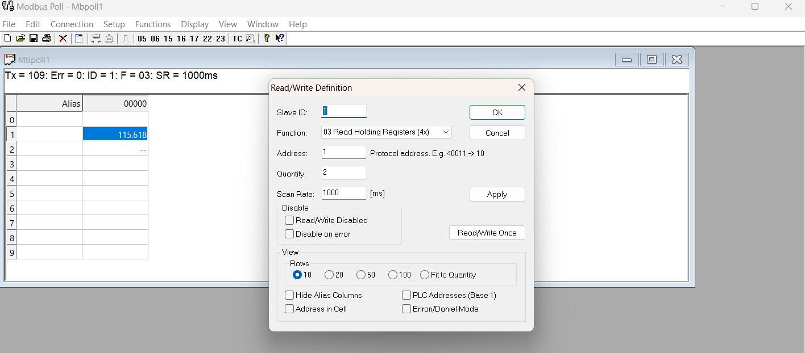

# __Como usar el Modbus GATEWAY ZLAN 5143D y ejemplo de aplicación__

## __ZLAN 5143D__ 
Este dispositivo es un lector de datos para entornos industriales que posee interfaz RS485 y RJ45. Tiene varias funcionalidades como Servidor de puerto serie y Modbus Gateway.
Nos vamos a enfocar en su función Modbus Gateway. 
### __Equipo a usar__
- Medidor de Energia PAC3120 [Datasheet](datasheet/PAC3120.pdf)
- Modbus Gateway ZLAN 5143D [Datasheet](datasheet/ZLAN5143D_en_DATASHEET.pdf)
- Laptop o cualquier dispositivo que pueda ser cliente Modbus TCP/IP
### __Programas a usar__
- [Modbus Poll](Software/ModbusPoll-20230630T204857Z-001.zip)
- [Zlvircom](Software/ZLVirCom_en.zip)

# __Conexiones__
El objetivo es leer un dispositivo que emplea comunicación Modbus RTU con interfaz RS485 mediante el Modbus Gateway que es pasarela RTU-TCP/IP. 


Como se observa en el diagrama, es importante tener en cuenta que el Modbus Gateway será configurado como TCP SERVER con el objetivo de que Modbus Poll se conecte a ese server para leer los registros. El cliente puede ser cualquier equipo con comunicación TCP/IP como por ejemplo un PLC S7-1200 de Siemens.
Realizado el diagrama procedemos a realizar las configuraciones

# __Configuraciones__
## __Software Zlvircom__ 
- Para configurar Zlvircom debemos de ir a la pestaña de __Device__.


- En esa pestaña apareceran los equipos conectados a la red, como estamos conectados por un switch al equipo, debería este aparecer en la lista.


- Seleccionamos el equipo que queremos configurar y le damos clic en __"Edit Device"__, en esta pestaña hacemos las siguientes configuaciones:


  Es importante no usar el puerto virtual, en la pestaña "Device info", seleccionamos Not Use.
  
  En la pestaña de __Network__, asignamos una IP estática al equipo, seteamos la IP que queramos, escogemos el PORT 502 y en __Work Mode__ configuramos como __TCP SERVER__.
  
  En la pestaña de __Serial__ especificamos las reglas de comunicación del equipo a ser leído, en este caso el medidor de energía __PAC3120__. Este equipo tiene se comunica con un  __baudrate__ de 19200, con trama __8N1__.
  
  En la pestaña de __Device Settings__ escogemos el protocolo de transferencia, que en este caso es __Modbus_TCP_Protocol__.
  Con esto nuestro Modbus Gateway queda configurado, solo debemos dar clic en __"Modify Setting"__ para guardar los datos.

__Nota:__ También es posible configurar al equipo directamente desde la interfaz web, con esto nos evitamos descargar el software.
Se escribe la dirección IP del equipo y podremos a acceder a la interfaz de configuración.

## __Software Modbus Poll__ 
Modbus Poll es una herramienta de software desarrollada para facilitar la comunicación y el monitoreo de dispositivos utilizando el protocolo Modbus. 
Este programa hará las solicitudes al __TCP SERVER__ que configuramos previamente para leer los registros del medidor, por lo tanto, se lo debe configurar como __TCP CLIENT__.
- Previo a esto verificamos que nuestra PC tenga conexión directa por ethernet con el modbus Gateway, para esto debemos estar en el mismo rango de IP del gateway. 

Una vez validado esto, hacemos ping al modbus Gateway desde la consola y verificamos que la conexión esté establecida.
 ```console
 $ ping 192.168.1.200
 ```
- Ahora para configurar la comunicación, se escoge una conexión __Modbus TCP/IP__,se agrega la dirección IP del servidor __192.168.1.200__ y finalmente se escoge el puerto __502__.

- Como ejemplo leeremos el primer registro del medidor de energía, que se trata de la tensión __VL1-N__:    

Tenemos que tener muy en cuenta el tipo de dato y longitud del registro, ademas de que tipo de acceso tiene(Escritura o lectura).
- Usaremos la función MODBUS 0x03, la cual nos permite leer registros de sostenimiento. Al escoger esta función en el software, automáticamente la base de direccionamiento es 4001 y solo debemos enfocarnos en el offset.

Es impotante escoger el ID del equipo según su configuración, en esta imagen vemos queremos leer el registro __4002__, pero solo pusimos el offset, y la cantidad __2__ determina cuantos registros de ese tipo, en este caso escogimos __2__ para solo leer los registros de la variable __VL1-N__. Al dar la opción "OK" el software comienza a hacer las solicitudes al TCP server y nos las muestra en pantalla que se ve en la imagen.


